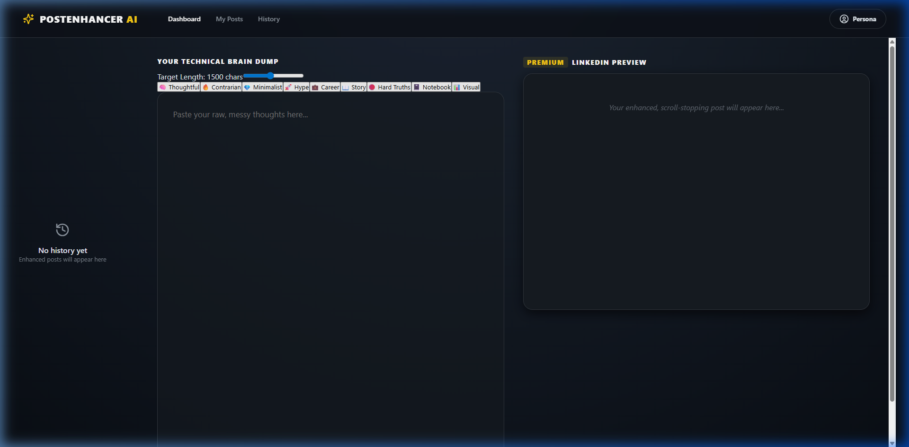
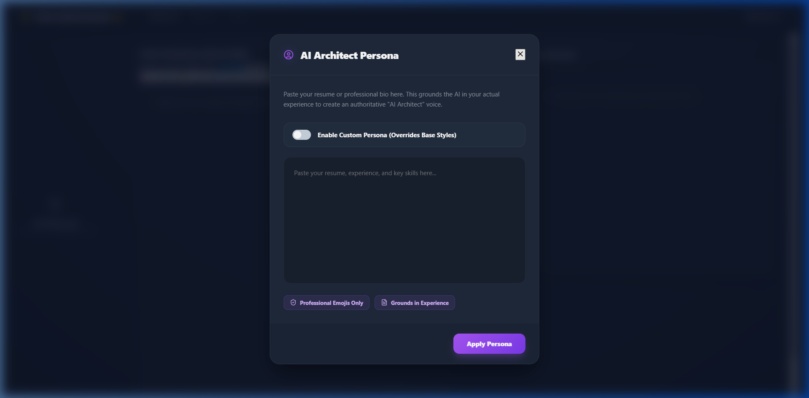
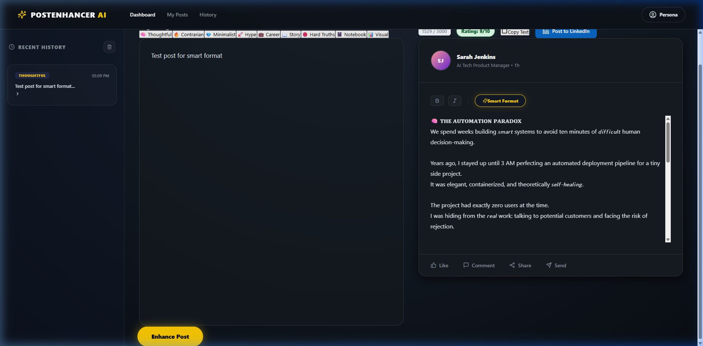
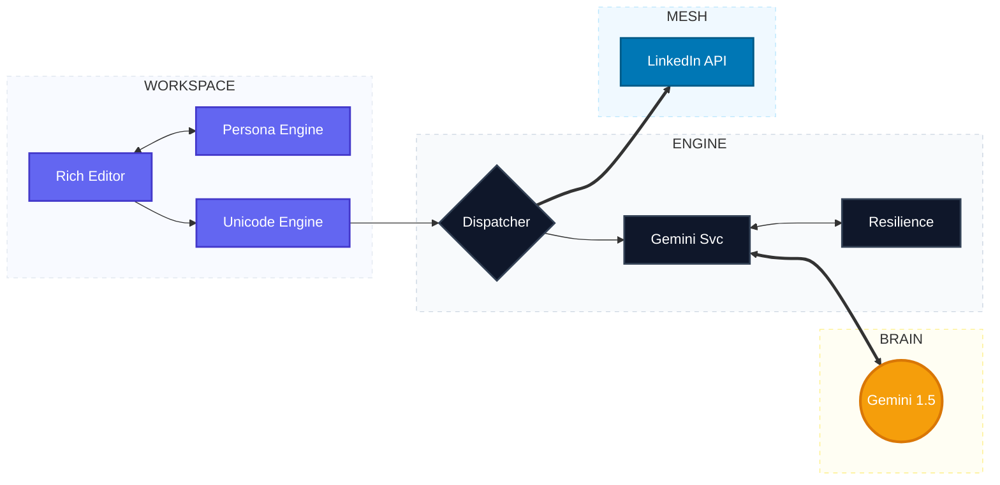

# 🏗️ PostEnhancer: LinkedIn Content Engine

An enterprise-grade, AI-native workspace designed to transform raw technical thoughts into high-authority LinkedIn content. Grounded in your professional persona and optimized for executive-level engagement.


---

## ✨ Visual Showcase

<table>
  <tr>
    <td width="50%"><br/><sub><b>Workspace Overview</b>: Dual-pane AI editor with premium LinkedIn preview.</sub></td>
    <td width="50%"><br/><sub><b>Persona Grounding</b>: Tailoring AI output to your specific technical expertise.</sub></td>
  </tr>
  <tr>
    <td colspan="2"><br/><sub><b>AI Smart Polish</b>: Dynamic Unicode transformation for automated visual hierarchy.</sub></td>
  </tr>
  <tr>
    <td colspan="2"><br/><sub><b>Animated Demo</b>: Watch the PostEnhancer workflow in action.</sub></td>
  </tr>
</table>

---

## �️ System Architecture

The application implements a decoupled Hexagonal-inspired architecture, ensuring maximum resilience and horizontal scalability.



---

## � Key Architectural Innovations

### 1. **Contextual Persona Grounding**
Unlike generic AI writers, our engine uses a **Dual-Layer Grounding** approach:
*   **Layer 1 (Authoritative Role)**: Sets the AI to a "Professional AI Architect" persona.
*   **Layer 2 (User Resume Grounding)**: Dynamically injects user-provided resume data into the LLM context, ensuring the output reflects your unique expertise and technical depth.

### 2. **Rich Text Unicode Engine**
LinkedIn does not natively support Markdown. Our system features a custom translation layer that converts standard text into **Mathematical Alphanumeric Symbols (Unicode)**, enabling:
*   **Bold (𝐚𝐛𝐜)** and *Italic (𝘢𝘣𝘤)* formatting directly in the LinkedIn feed.
*   **Zero-Loss Encoding**: Ensures accessibility readers still parse the content correctly while looking premium.

### 3. **AI-Assisted Visual Hierarchy (Smart Polish)**
The **Smart Format** feature uses a secondary LLM pass to analyze the visual hierarchy of the post. It identifies:
*   Primary technical concepts for **Bold** emphasis.
*   Strategic action verbs for *Italic* emphasis.
*   Optimized spacing for "scroll-stop" readability.

### 4. **Resiliency & Observability**
*   **Exponential Backoff**: Integrated `async-retry` logic to handle LLM rate limits or transient outages.
*   **End-to-End Tracing**: Every event from UI click to LLM response is tagged with a unique `Correlation-ID` for production-grade debugging via Winston logs.

---

## �️ Setup & Deployment

### **Prerequisites**
- Docker (20.x+) & Docker Compose
- Google AI Studio API Key

### **1. Environment Configuration**
```bash
# Clone the repository
git clone https://github.com/your-repo/PostEnhancer.git
cd PostEnhancer

# Create environment file
cp .env.example .env
# Edit .env with your GEMINI_API_KEY
```

### **2. Launch Containerized Environment**
```bash
docker-compose up --build
```
*   **Frontend**: `http://localhost:5173`
*   **API Documentation**: `http://localhost:3000/api/enhance` (POST)

---

## 🏗️ Engineering Standards
*   **SOLID Principles**: Modular service layer for easy replacement of LLM providers.
*   **Container Abstraction**: Entire stack is environment-agnostic via Docker.
*   **Strict JSON Interface**: Uses Gemini's `responseMimeType: "application/json"` to ensure 0% hallucination in response structures.
*   **Winston Logging**: Structured JSON logging for ELK-stack compatibility.

---

## 🛣️ Project Evolution
- [x] **Phase 1**: Core Transformation Engine (React/Node/Gemini).
- [x] **Phase 2**: Direct LinkedIn API Integration.
- [x] **Phase 3**: Custom Persona & Resume Grounding.
- [x] **Phase 4**: Rich Text Unicode Engine & Smart Format.
- [ ] **Phase 5**: Multi-modal Support (Auto-generate Infographics via Mermaid).
- [ ] **Phase 6**: Sentiment & Engagement Predictive Scoring.

---

## 📄 License
Licensed under the [MIT License](LICENSE). 
*Designed for Architects. Built for Impact.*
